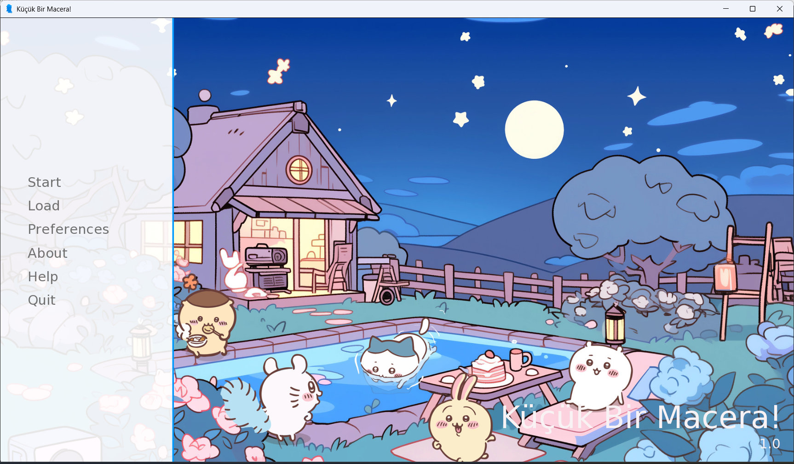
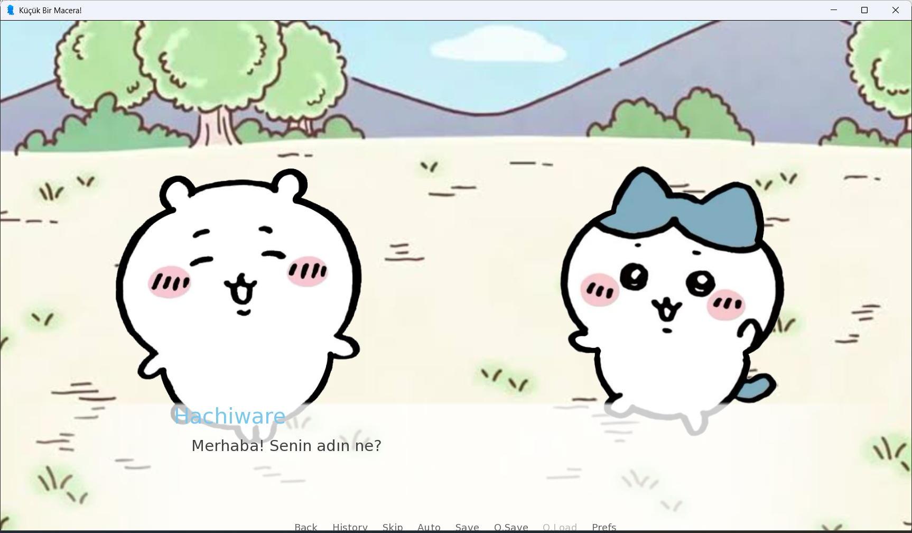
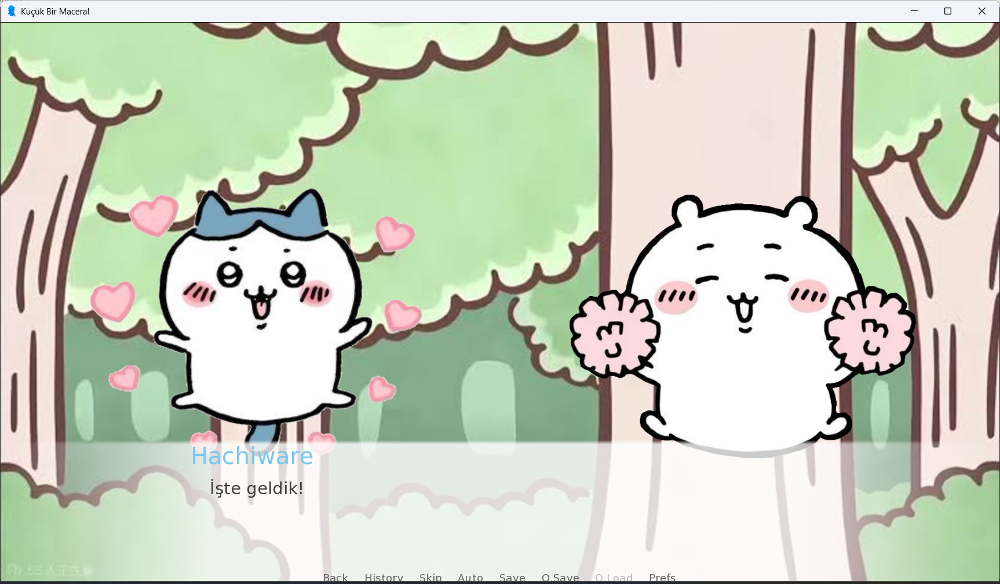

# Küçük Bir Macera! | A Little Adventure

##  TR

###  Oyun Hakkında

**Küçük Bir Macera!**, Chiikawa evreninden esinlenerek hazırlanmış kısa bir Ren'Py visual novel oyunudur.

Oyuncu önce kendi ismini girer. Daha sonra Chiikawa ve Hachiware ile tanışarak küçük bir maceraya çıkar.

###  Kullanılan Teknolojiler

- Ren'Py 8.5.3
- Python

###  Nasıl Oynanır?

1. **Releases** bölümünden `.zip` dosyasını indirin.
2. ZIP dosyasını bilgisayarınıza çıkartın.
3. Çıkartılan klasörün içindeki `.exe` dosyasını çalıştırın.
4. Oyunu oynamaya başlayın.

> Oyunu çalıştırmak için Ren'Py'nin bilgisayarınızda kurulu olması gerekmez.

###  Proje Hakkında

Bu proje üniversite ödevi kapsamında eğitim amacıyla hazırlanmıştır.

---

##  EN

### About the Game

**A Little Adventure!** is a short Ren'Py visual novel inspired by the Chiikawa universe.

The player first enters their name. Then, they meet Chiikawa and Hachiware and go on a little adventure together.

### Technologies Used

- Ren'Py 8.5.3
- Python

### How to Play

1. Download the `.zip` file from the **Releases** section.
2. Extract the ZIP file on your computer.
3. Run the `.exe` file inside the extracted folder.
4. Start playing the game.

> Ren'Py does not need to be installed to play the game.

### About the Project

This project was created for educational purposes as a university assignment.

---
## Ekran Görüntüleri | Screenshots

### Ana Menü | Main Menu

### Oyun İçi | In Game

##  Lisans | License

### TR

Bu projenin özgün kodları MIT Lisansı altında sunulmaktadır.

Chiikawa ve karakterleri ile projede kullanılan üçüncü taraf görsel ve ses varlıkları bu lisans kapsamında değildir ve ilgili hak sahiplerine aittir.

Bu proje üniversite ödevi kapsamında eğitim amacıyla hazırlanmıştır ve ticari bir amaç taşımamaktadır.

### EN

The original code of this project is licensed under the MIT License.

Chiikawa and its characters, as well as third-party visual and audio assets used in this project, are not covered by this license and belong to their respective copyright holders.

This project was created for educational purposes as a university assignment and is not intended for commercial use.
